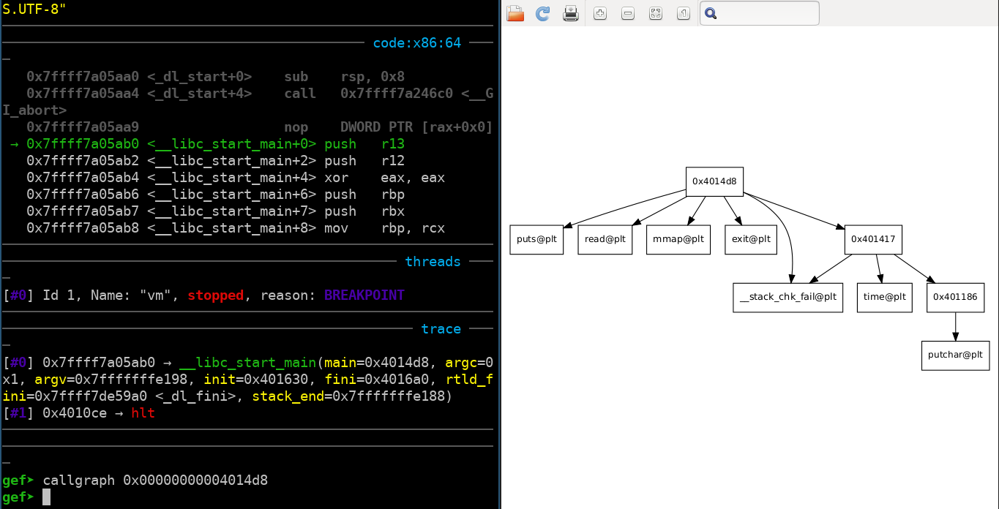
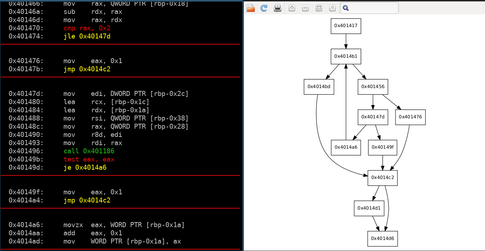
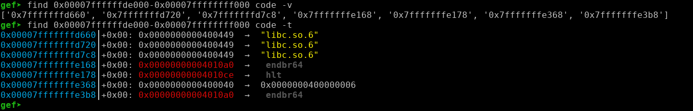

# gdb-gef addons

Some plugin's I've writen for [gdb-gef](https://github.com/hugsy/gef). Most are written for the fun of it rather than for any actual use.

## Install

```bash
git clone https://github.com/vigneshsrao/gef-scripts.git ~/gef

echo "source ~/gef/*.py" >> ~/.gdbinit
```
Use the `.gdbinit-gef` file from this repo as well.

## Features

### `callgraph`

```
callgraph <start_address>
```

Display the function call graph, given the function where to start from.



### `graph`
```
graph <start_address> [-v]
```

Display the control flow graph, given the starting address of the function. It displays the disassembly block-by-block.

The `-v` option will also display the graph in `xdot`, so we can interactively view the graph.



### `find`
```
graph <haystack_start_address>-<haystack_end_address> needle_address_range_name [-t]
```

Search for an address from a specific range in another address range. The `-t` option displays the results in a telescopic manner.


### `code`

Get the start address of the code segment

```
gef➤ code
hello:	0x400000
```
### `libc`
Get the start address of the libc
```
gef➤ libc
/lib/x86_64-linux-gnu/libc-2.27.so:	0x7ffff79e4000
```

### `heapm`
Get the start address of the heap segment if it exists.
```
gef➤ heapm
heap:	0x555555757000
```
### `rename`

Rename a function address

```
rename <address> <name>
```

This address will now be shown as `name` when we do `graph` as well as in the disassembly window in the `context`

### `pd`

peda's `pd` command for pretty disasm!

### `parse`

Copy paste structs from ida. This creates an struct_name.py file in the structs folder, so that it can be easily read by gef's `pcustom` utility

```
gef➤ parse
00000000 sample          struc ; (sizeof=0x17, mappedto_1)
00000000 field_0         dq ?
00000008 field_8         dq ?
00000010 field_10        dw ?
00000012 field_12        dd ?
00000016 field_16        db ?
00000017 sample          ends

Parsing sample
field_0 => c_ulong
field_8 => c_ulong
field_10 => c_short
field_12 => c_int
field_16 => c_char

[+] Done
```

### `aap`
Sometimes `plt` functions are not recognized and are printed as addresses instead of function names. This attempts to fix that.

It also demangles `c++` symbols that have been mangled if the `-d` option is passed.

## Improvements

There are lot of improvements to be made. The graph script fails when it encounters instructions like `jmp rax`. Also all the commands work only for `x86-64` architectures.
